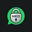

# Priv WhatsApp Web 

**Priv WhatsApp Web** is a modern, privacy-focused browser extension that secures your WhatsApp Web session in public spaces, offices, or shared computers. It blurs messages, user/group names, profile pictures, media previews, and input fields until you hover over them.

This project is a heavily enhanced, modernized, and redesigned fork of the original **[Privacy Extension for WhatsApp Web](https://github.com/LukasLen/Privacy-Extension-For-WhatsApp-Web)** by **Lukas Lenhardt**. It fixes all broken CSS selectors due to WhatsApp Web updates and adds advanced security features like Screen Lock, Focus Loss Blur, Global Hotkeys, and Selective Chat Blur.

---

## Key Features & How to Use Them

### 1. Hover-to-Reveal Blur Effects
- **What it blurs**: Messages (in chat & sidebar previews), profile pictures, group/usernames, media previews, text input area, and gallery icons.
- **How to reveal**: Simply hover your mouse cursor over the blurred element. It will instantly reveal (with an optional transition delay which you can toggle off).

### 2. Screen Lock (App Lock)
- **How it works**: Protects your WhatsApp Web session from unauthorized access when you step away.
- **Set Up**:
  1. Open the **Priv WhatsApp Web** extension menu.
  2. Click the setting drop-down icon next to **Screen Lock**.
  3. Enter a secure password and click **Set**.
  4. Specify an idle timeout duration (e.g. 60 seconds) and click the checkmark **✔**.
- **How to Lock**: 
  - The screen will lock automatically after the specified idle timeout.
  - You can click the **Lock Now** button inside the extension menu.
  - Use the hotkey **`Alt + L`** to lock the screen instantly.

### 3. Focus Loss Auto-Blur
- **How it works**: Automatically blurs your entire WhatsApp Web tab the moment you switch to another browser tab or minimize/focus away from the browser window.
- **How to enable**: Toggle the **Blur on Focus Loss** option in the extension popup menu.

### 4. Global Hotkeys
- **`Alt + X`**: Instantly toggles the entire privacy blur active/inactive.
- **`Alt + L`**: Instantly locks the session (requires a configured Screen Lock password).

### 5. Selective Chat Blur (Custom Chat Blur)
- **How it works**: Apply privacy blur selectively to specific chats instead of everything globally.
- **How to use**:
  1. Toggle **Selective Blur** in the extension popup.
  2. To blur the current active conversation, click the **+ Blur Current Chat** button.
  3. Alternatively, type the name of a contact or group in the input field and click **Add**.
  4. To remove a chat, click the delete (**×**) button next to it in the active list.

## Inspiration & Acknowledgments
This extension is developed by **Muhammed Erkam DOKUR** and is built on top of the original open-source extension **Privacy Extension for WhatsApp Web** by **Lukas Lenhardt** (MIT License). All selector engines, styles, and locale handlers were updated, modernized, and expanded with advanced features with the assistance of AI pair programming.

### v1.0.0 (Initial Release Notes)
- **New Rebranding**: Launched **Priv WhatsApp Web** with a brand new vector logo (secure padlock featuring "MED") and a futuristic cyber-blue/cyan theme.
- **Selector Overhaul**: Rewrote all broken CSS selectors to restore full support for the latest WhatsApp Web updates.
- **New Privacy Protections**:
  - **Screen Lock (App Lock)**: Idle timer password protection or instant hotkey locking.
  - **Focus Loss Blur**: Instantly blurs/hides the WhatsApp Web screen when tab focus is lost.
  - **Global Hotkeys**: Toggle privacy mode (`Alt + X`) or Lock screen (`Alt + L`).
  - **Selective Chat Blur**: Choose exactly which chats/groups to blur instead of blurring globally.

---

## How to Install (For Developers / Local Testing)
1. Clone or download this repository.
2. In Google Chrome, go to `chrome://extensions/`.
3. Enable **Developer mode** (top-right corner switch).
4. Click **Load unpacked** (top-left button).
5. Select the `src` folder from this project directory.
6. The extension is now loaded and active!

## License
This project is licensed under the MIT License - see the [LICENSE](LICENSE) file for details.
